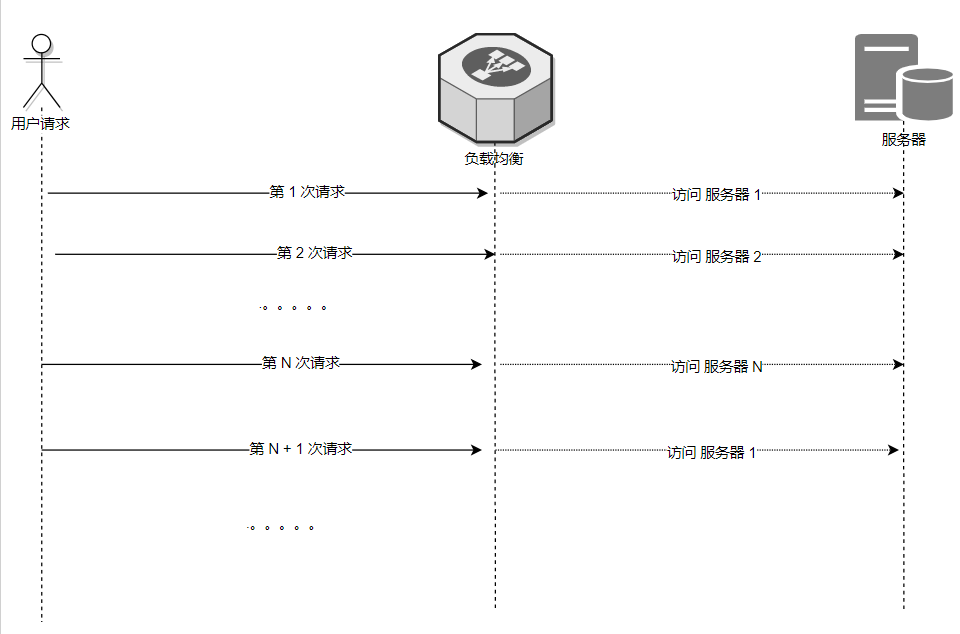
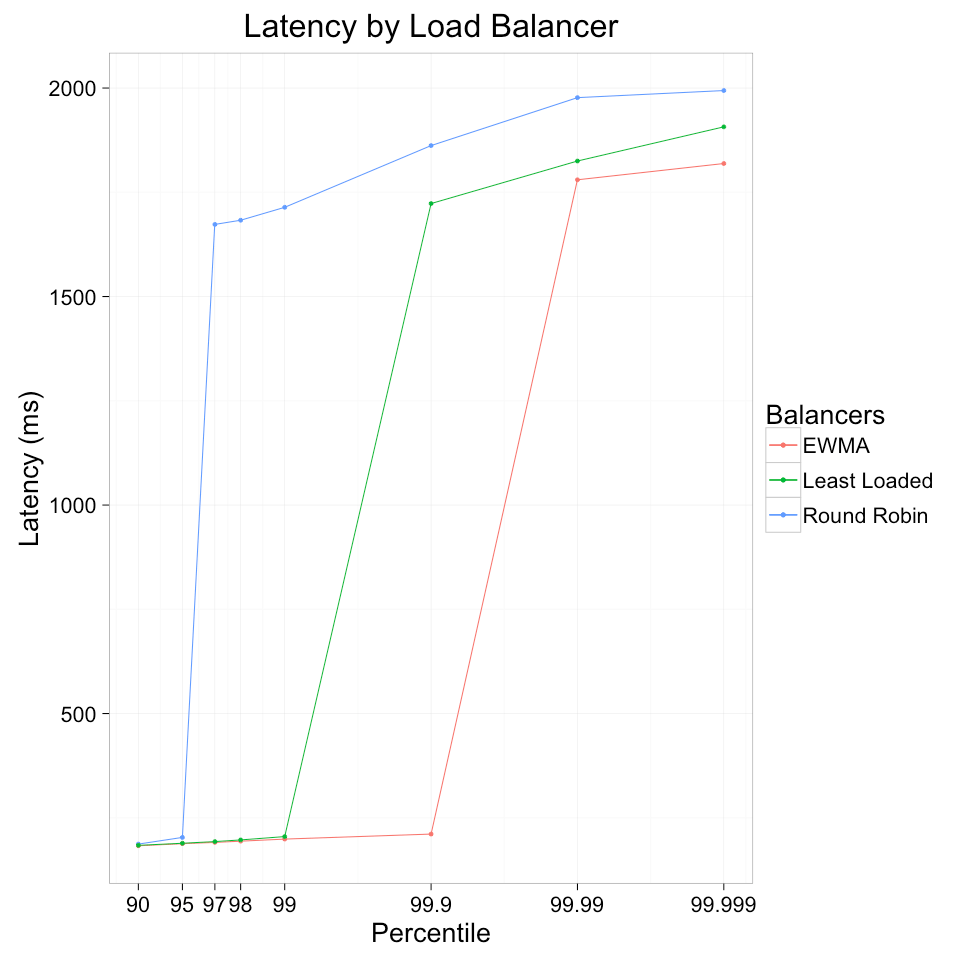

# 什么是负载均衡
负载均衡，英文名称为Load Balance，其含义就是指将负载（工作任务）进行平衡、分摊到多个操作单元上进行运行

以下为几种负载均衡策略介绍

## 1.随机（Random）
大家很多时候说到随机的负载均衡都会想到 Round Robin， 其实 Round Robin并非随机，

Random 这种是真正意义上随机，根据随机算法随意分配请求到服务器。

* 优点：

    - 有了负载能力

* 缺点：

    - 受随机算法影响，并不能均衡各个服务器的负载， 
    - 也不能根据服务器的负载情况进行自我调节
所以基本很少有如此单纯的真随机策略了

##  2.轮循（Round Robin）
如上述，其实轮询是平均策略，并非随机策略，

它的具体策略内容如下：

  负载均衡负责者有一份 服务器列表，

  它会将其做排序，形成固定的 1 到 N 的顺序列表排队，

  每次请求都会队列依次选择一位没有轮到的服务器同志接受 请求任务，

  当整个队列都接受过任务后，就会从头开始新一轮的任务排队。

而大家为什么很多时候又说它是随机策略呢？

主要是对请求的client 来说， 这一次和下一次请求的服务器并不一定是同一个服务器，所以像是随机。

* 优点：

    - 负载非常平均

* 缺点：

    - 不能根据服务器差异（比如性能）调配负载情况
    - 由于是顺序 1 开始， 如果一开始就是瞬间大并发流量大的情况，第一台存在被击垮的风险

## 3.最少连接 （Least Connection）
从名字我们就能很轻松明白了，

它的策略非常简单： 就是每次取连接计数最小的那个服务器使用

* 优点：

    - 能根据连接数变化动态平衡资源情况
    - 长连接多的场景（比如 ftp），资源调配很合理
* 缺点：

    - 但在服务器资源差异情况下，连接数并不能平衡这种差异
    - 动态增删服务器列表的场景，请求都会命中新加入的服务器，大流量易击垮这台服务器    （一般会通过 缓启动策略减低对应负载，降低风险）
## 4.Hash 
其他的负载均衡策略都适合于无状态服务，

只有 Hash 是专门解决有状态服务的负载均衡问题的。

它的具体策略就以其中简单的做法作为说明：

  比如 ip 或者 url hash，  会用 ip 或者 url 的string  根据 hash 算法 算出固定的整型数值，

  然后用该整型数值 根据 服务器数量 取模运算 得出对应哪一台机器，

  从而形成 粘机 的效果

* 优点：

    - 解决了有状态服务无法负载均衡的问题
* 缺点：

    - 服务器下线，可能导致 部分粘机的访问仍然访问失效的机器 （一般会通过health check 识别下线，然后重新hash 粘机）
    - 如采用有重新 hash 粘机的算法策略，需要业务方处理上规避其带来的影响，比如不能将数据只放在粘机的服务器上
## 5. EWMA 
印象中好像该方式最早见于 Finagle(Twitter的客户端RPC库) 中。

理论上来说服务器 在cpu 算力不足，网卡负荷过大，端口不足等等各种情况下，响应的时间都会存在明显变长的情况

那么响应的延迟变化就可以一定程度上用来评价服务器的负载以及服务器自身情况，

EWMA 的思想就是衡量请求延迟变化来动态优化负载均衡效果。

简单来说，EWMA就是 保持每个服务器请求的往返时间的移动平均值，以未完成请求的数量加权，并将流量分配给成本函数最小的服务器。

一般来说，还会使用P2C策略结合 EWMA使用，以避免同一时间集中命中同一台服务器。 （P2C 就是随机选取两台服务器，比较他们俩的EWMA值，取最小的那一个）

linkerd 做过一个负载均衡的测验，其结果  （当然并不一定代表实际效果）

* 优点：

    - 算法能更好根据变化情况动态调整负载情况
* 缺点：

    - 业务场景本身就是高延迟的情况，比如长轮询，该算法就不能衡量出服务器的负载情况

## 权重的特殊说明
严格来说，权重很少作为单独的负载均衡策略，

一般都是与上述各种负载均衡策略进行组合。

权重的目的主要是解决 我们在已知或者能预估出服务器的负载能力的情况下， 我们如何更好的预设资源的分配。

所以现在一般这些负载均衡算法都会提供 权重参数以便大家预设负载比例，

甚至一些还尝试用机器学习等手段动态调整权重参数等，以便更快调整资源负载情况