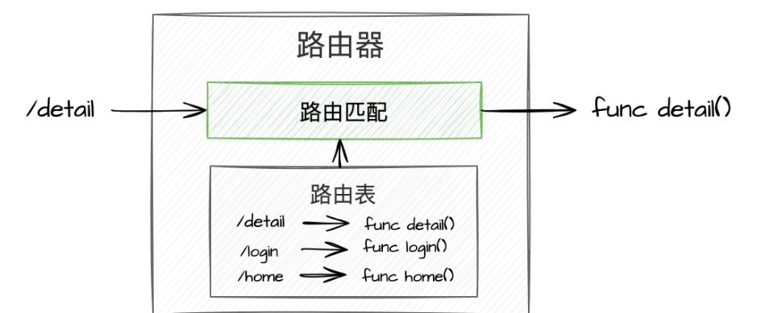

# http路由

路由是指路由器从一个接口上收到数据包，根据数据包的目的地址进行定向并转发到另一个接口的过程。

而这里的http路由其实等同于web开发中，根据http相关参数（比如url、http method）分配到对应的处理程序。

借用web框架的示意图，其作用如下

## 路由匹配

这里我们先简化一下内容，假设我们已有 upstream ip、port，现在只需能区分各种请求怎么样对应到这些不同的upstream上，不必关心能否做改写请求啊、熔断啊等等复杂情况

那么怎么实现路由匹配呢？

通常为以下两种方式

1. 字典+正则表达式

    字典用于匹配精确的结果（比如 url == /login 情况），字典的特性保证这类匹配具有超高性能

    正则表达式用于匹配复杂模糊的结果（比如 url 以 .html 为后缀的所有请求）， 当然多项正则表达式只能依次遍历，性能肯定存在问题（为了缓解性能问题，通常会使用缓存做优化）

2. 前缀树

    前缀树，又称字典树，是一种有序树，用于保存关联数组，其中的键通常是字符串。

    其由于插入和查询的效率很高，非常适合路由匹配的情况
    
    虽然理论hash性能最好，前缀树仍需查找，效率会低一些，
    
    但毕竟通常开发都会使用比较复杂的路由， 所以效率肯定比上面的 字典+正则表达式 要高很多

### 路由匹配实践