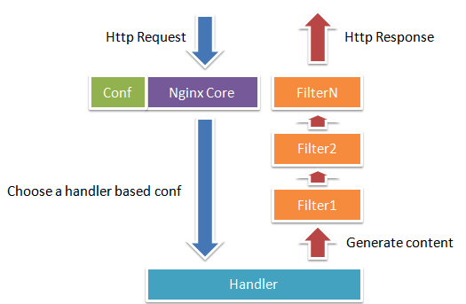
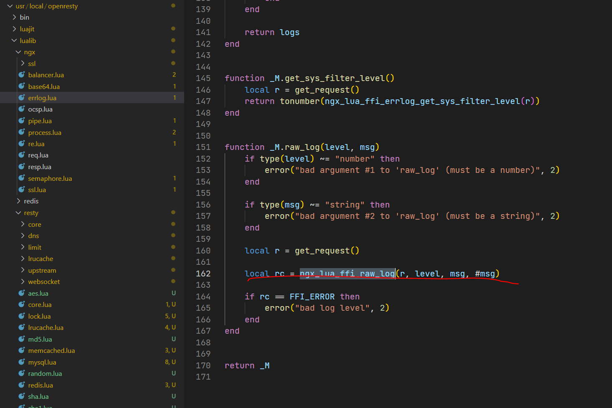
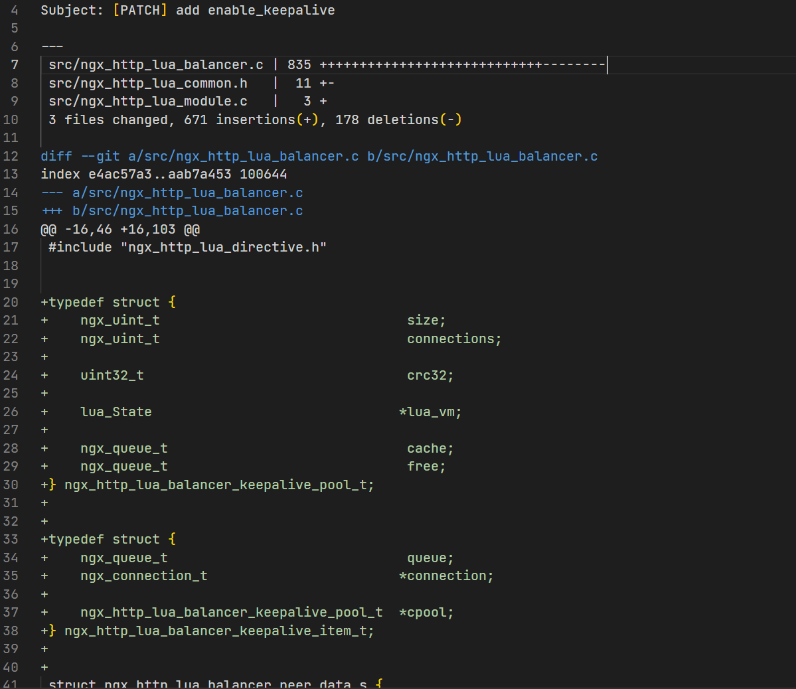

# 如何给openresty打patch

由于很多功能实现的限制，我们不得不修改openresty，但我们又不一定能持续维护一个 openresty 分支，所有有了patch 这一操作。

## patch是怎么补“漏洞”的？

patch 中文含义为补丁，给大家的感觉就像在原来的基础上修复漏洞，就像小时候旧衣服上缝缝补补的那些痕迹

比如在window 系统更新等等地方，每一个patch都是在做类似补漏洞的事情（或者添加一些新功能之类）

系统包含的东西太多，有内核，有功能组件，一个功能可能是一个程序，也可能是一堆程序，所以比较复杂。

我们不如将范围缩小到 openresty 这样单独具体的程序来举例说明。

首先我们回忆一下 openresty 各种各样的功能是怎么组合起来的呢？

openresty基于 nginx， Nginx 具有高扩展特性，它从设计上完全就由多个不同功能、不同层次、不同类型且耦合度极低的模块构成，因此，当对某一个模块修复 Bug 或 进行升级的时候，可以专注于模块本身，无需在意其他。

### 模块示意



下图展示了一次常规请求和响应的时序图


所以第一种打补丁的方式： 替换掉模块程序

## 替换掉模块程序

我们针对不同的模块程序，可以做不同的事情，举例如下：

### 1. 替换掉lua 代码
openresty 中lua为动态代码特性提供这个可能性

比如下图我们可以改掉 log的代码



### 2. 替换掉so
大家都知道 openresty的很多 c 库都是编译成 so 文件使用

so文件是Linux下的程序函数库,即编译好的可以供其他程序使用的代码和数据

linux下何谓.so文件：

1. 用过windows的同学应该都知道 .dll文件吧, 这二者有什么共通之处呢,其实 .so文件就跟.dll文件差不多
2. 一般来说.so文件就是常说的动态链接库, 都是C或C++编译出来的。与Java比较就是：它通常是用的Class文件（字节码）
3. Linux下的.so文件时不能直接运行的,一般来讲,.so文件称为共享库
比如在docker环境由于 lfs.so 有着 gcc版本要求（毕竟编译它的版本不算太低，有些docker阉割了gcc，导致加载有问题），所以就可以替换为符合docker环境的版本

### 简陋的patch方式有没有什么问题呢？

聪明的同学们肯定已经想到了上面说的方式太简陋了，

面临着以下几个问题：

1. nginx 内部的一些代码无法patch，毕竟不是所有c 都变成了 so
2. 手动打的这些patch 很难管理， openresty 一直在更新，每个版本都手动一行行改太累了

## patch 的管理方式

现在大家在需要改动代码做patch 一般都使用 git 来完成这个事情

接下来我给大家做个示例：

#### 1. 修改代码，生成 patch文件
修改代码就不用示例了吧

生成patch 文件可以用git 命令  

``` sh
git diff f915e0dbe520938b7a84bd0e5c1cf12cf64c4186 97d1b704d0d86b5370d57604a9e2e3f86e4a33ec --no-prefix > enable_keepalive.patch
```

部分文件结果



#### 2. 应用 patch

在需要打补丁的目录下运行命令

``` sh
patch -p0 --verbose < "enable_keepalive.patch"
```

代码文件就会被改变

一般这些patch 我们都会编写脚本做管理，

完整的一个例子你们可以参见 [https://github.com/fs7744/nature/tree/main/openresty_patch](https://github.com/fs7744/nature/tree/main/openresty_patch)

## [目录](https://fs7744.github.io/nature/)