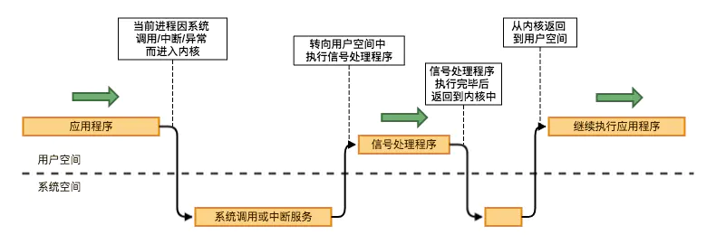
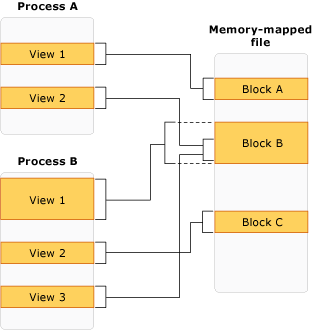

# 进程间通讯有哪些方式

进程间通信(inter-process communication 或 interprocess communication，简写 IPC)是指两个或两个以上进程(或线程)之间进行数据或信号交互的技术方案。

## 文件

没错，文件就是进程间通信的一种方式。

## 信号(signal)

像`Ctrl+C`退出之类或`kill`等都是信号

### 信号量(semaphore)

信号量(semaphore) 通常是防止出现因多个程序同时访问一个共享资源而引发的一系列问题的手段。与信号(signal) 不是一回事。

信号量是一个特殊的变量，程序对其访问都是原子操作，且只允许对它进行等待（即 P(信号变量))和发送（即 V(信号变量))信息操作。

## 管道

管道的实质是一个内核缓冲区，进程以先进先出的方式从缓冲区存取数据，管道一端的进程顺序的将数据写入缓冲区，另一端的进程则顺序的读出数据。

匿名管道(Pipe)是一种半双工的通信方式，数据只能单向流动，而且只能在具有亲缘关系的进程间使用。进程的亲缘关系通常是指父子进程关系。

命名管道(FIFO)为解决亲缘性问题而诞生，提供了一个路径名与之关联，以有名管道的文件形式存在于文件系统中，这样，即使与有名管道的创建进程不存在亲缘关系的进程，只要可以访问该路径，就能够彼此通过有名管道相互通信，因此，通过有名管道不相关的进程也能交换数据。值的注意的是，有名管道严格遵循先进先出(first in first out),对匿名管道及有名管道的读总是从开始处返回数据，对它们的写则把数据添加到末尾。它们不支持诸如 lseek()等文件定位操作。有名管道的名字存在于文件系统中，内容存放在内存中。

## 共享内存(Shared memory)

允许多个进程访问同一个内存块，该内存块作为一个共享缓冲区，供进程间相互通信，是最快的 IPC 形式。

| 类型                  | 原理                                         | 易失性                       |
| --------------------- | -------------------------------------------- | ---------------------------- |
| mmap                  | 利用文件(open)映射共享内存区域               | 会保存在磁盘上，不会丢失     |
| Posix shared memory   | 利用/dev/shm 文件系统(mmap)映射共享内存区域  | 随内核持续，内核自举后会丢失 |
| SystemV shared memory | 利用/dev/shm 文件系统(shmat)映射共享内存区域 | 随内核持续，内核自举后会丢失 |

### 内存映射文件(Memory-mapped file)

也属于共享内存的一种方式，类似于标准的文件，内存映射文件映射到 RAM，可以直接对内存地址进行更改，而不是更改输出流。

## 消息队列(Message queue)

消息队列是存放在内核中的消息链表，每个消息队列由消息队列标识符表示。

## 套接字(Socket)

分为两类：

1. AF_INET，它指的是 Internet 网络。当客户使用套接字进行跨网络的连接时，它就需要用到服务器计算机的 IP 地址和端口来指定一台联网机器上的某个特定服务，所以在使用 socket 作为通信的终点，服务器应用程序必须在开始通信之前绑定一个端口，服务器在指定的端口等待客户的连接。

2. AF_UNIX，表示 UNIX 文件系统(Unix domain socket)，它就是文件输入/输出，而它的地址就是文件名。仅用于在同一台机器上运行的进程之间的通信，UNIX 域套接字比 Internet 网络域套接字效率更高。UNIX 域套接字仅仅复制数据；它们并不执行协议处理，不需要添加或删除网络报头，无需计算检验和，不要产生顺序号，无需发送确认报文。
   如下即为：
   

## [目录](https://fs7744.github.io/nature/)