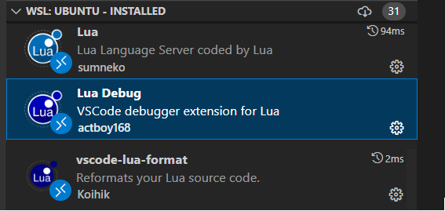

# 配置vscode

本人使用vscode 编译lua程序，所以介绍vscode

大家也可以选择自己喜欢的其他IDE

安装如下插件足以

- [Lua](https://marketplace.visualstudio.com/items?itemName=sumneko.lua)
- [Lua Debug](https://marketplace.visualstudio.com/items?itemName=actboy168.lua-debug) (其实编写openresty用不到，不过对于初学lua的人还是有用处的)
- [vscode-lua-format](https://marketplace.visualstudio.com/items?itemName=Koihik.vscode-lua-format)

## [lua 语言目录](https://fs7744.github.io/nature/prepare/lua/index.html)
## [总目录](https://fs7744.github.io/nature/)