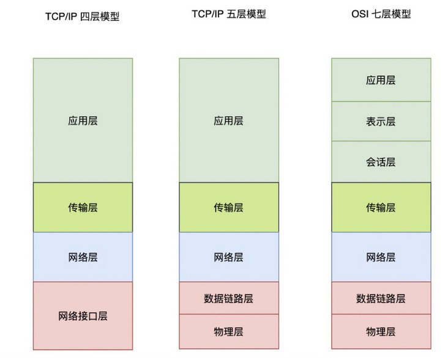
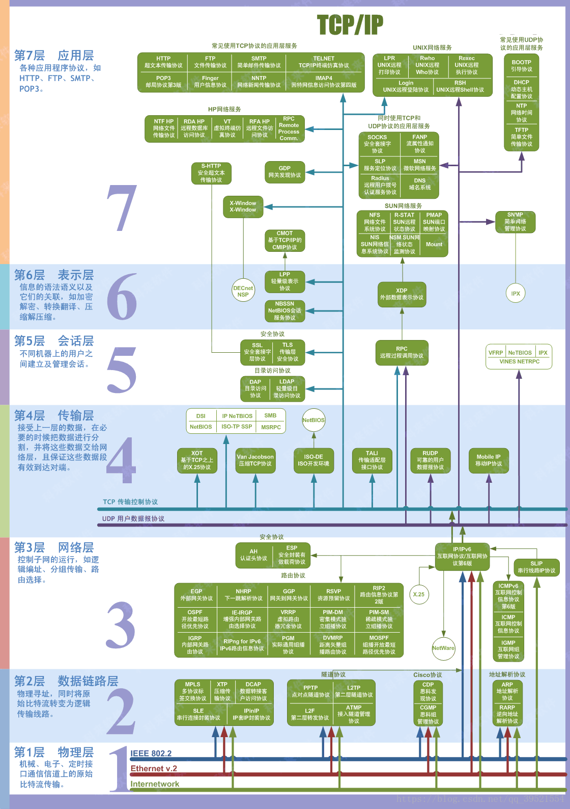
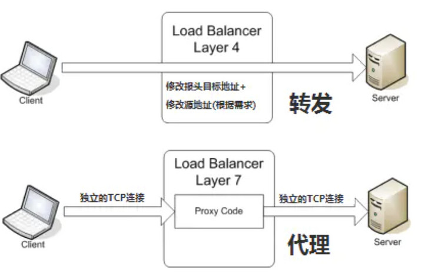

# 2. 网络概念

网关软件一般分为四层或七层代理，为什么有这样区分呢？

既然我们要尝试完成一个网关，我们可能的了解一下四层、七层到底是什么，否则我们做什么呢?

这里所谈的四层代理和七层代理，便是基于OSI七层模型来划分的。

## OSI 七层网络模型

OSI（Open System Interconnect），即开放式系统互联。 一般都叫 OSI 参考模型，是 ISO（国际标准化组织）组织在 1985 年研究的网络互连模型。

ISO 为了更好的使网络应用更为普及，推出了 OSI 参考模型。

其含义就是推荐所有公司使用这个规范来控制网络。这样所有公司都有相同的规范，就能互联了。

OSI 定义了网络互连的七层框架（物理层、数据链路层、网络层、传输层、会话层、表示层、应用层），即 ISO 开放互连系统参考模型。

以下是其经典图示

- **物理层**：

  解决两个硬件之间怎么通信的问题，常见的物理媒介有光纤、电缆、中继器等。它主要定义物理设备标准，如网线的接口类型、光纤的接口类型、各种传输介质的传输速率等。
  
  它的主要作用是传输比特流（就是由 1、0 转化为电流强弱来进行传输，到达目的地后在转化为 1、0，也就是我们常说的数模转换与模数转换）。这一层的数据叫做比特。

- **数据链路层**：

  在计算机网络中由于各种干扰的存在，物理链路是不可靠的。该层的主要功能就是：通过各种控制协议，将有差错的物理信道变为无差错的、能可靠传输数据帧的数据链路。
  
  它的具体工作是接收来自物理层的位流形式的数据，并封装成帧，传送到上一层；同样，也将来自上层的数据帧，拆装为位流形式的数据转发到物理层。这一层的数据叫做帧。

- **网络层**：

  计算机网络中如果有多台计算机，怎么找到要发的那台？如果中间有多个节点，怎么选择路径？这就是路由要做的事。
  
  该层的主要任务就是：通过路由选择算法，为报文（该层的数据单位，由上一层数据打包而来）通过通信子网选择最适当的路径。这一层定义的是 IP 地址，通过 IP 地址寻址，所以产生了 IP 协议。

- **传输层**：

  当发送大量数据时，很可能会出现丢包的情况，另一台电脑要告诉是否完整接收到全部的包。如果缺了，就告诉丢了哪些包，然后再发一次，直至全部接收为止。
  
  简单来说，传输层的主要功能就是：监控数据传输服务的质量，保证报文的正确传输。

- **会话层**：

  虽然已经可以实现给正确的计算机，发送正确的封装过后的信息了。但我们总不可能每次都要调用传输层协议去打包，然后再调用 IP 协议去找路由，所以我们要建立一个自动收发包，自动寻址的功能。于是会话层出现了：它的作用就是建立和管理应用程序之间的通信。

- **表示层**：

  表示层负责数据格式的转换，将应用处理的信息转换为适合网络传输的格式，或者将来自下一层的数据转换为上层能处理的格式。

- **应用层**：

  应用层是计算机用户，以及各种应用程序和网络之间的接口，其功能是直接向用户提供服务，完成用户希望在网络上完成的各种工作。前端同学对应用层肯定是最熟悉的。

## 四层代理
四层代理主要工作于OSI模型中的传输层，传输层主要处理消息的传递，而不管消息的内容。TCP就是常见的四层协议。

四层负载均衡只针对由上游服务发送和接收的网络包，而并不检查包内的具体内容是什么。四层负载均衡可以通过检查TCP流中的前几个包，从而决定是否限制路由。

因此，四层负载均衡的核心就是IP+端口层面的负载均衡，不涉及具体的报文内容。

典型代表：
* 硬件： F5 、 radware 、Citrix NetScaler 等等
* 软件： LVS、nginx、haproxy、envoy 、Katran、mson 等等

## 七层代理
七层代理主要工作于OSI模型的应用层，应用层主要用来处理消息内容的。比如，HTTP便是常见的七层协议。

七层负载均衡服务器起到了反向代理的作用，Client端要先与七层负载均衡设备三次握手建立TCP连接，把要访问的报文信息发送给七层负载均衡。

七层负载均衡器基于消息中内容( 比如URL或者cookie中的信息 )来做出负载均衡的决定。之后，七层负载均衡器建立一个新的TCP连接来选择上游服务并向这个服务发出请求。

使用七层负载均衡的设备经常被用于反向代理。

典型代表：
* 软件： nginx、haproxy、envoy、mson 等等

## 两者区别
先通过一张图来看看四层代理和七层代理的区别：

上图中最直观的区别是四层代理只进行了一次TCP请求，而七层代理进行了两次TCP请求。

四层代理：四层代理拆解报文至传输层，根据请求的服务器IP+端口号进行转发；四层代理是由后端服务器进行处理，包括报文的封装都是后端服务器进行封装；四层代理相当于是一个路由器。不关心应用协议（如HTTP/FTP/MySQL等）。

七层代理：七层代理拆解报文至应用层，分析用户请求的资源，然后负载均衡器会代替用户请求后端服务器的资源；后端服务器把资源返回给负载均衡器，负载均衡器对资源再次进行封装，然后返还给客户端；在此过程中，需要建立两次TCP连接，一次是客户端，一次是后端的服务器。主要着重于应用HTTP协议。

七层负载均衡的CPU密集程度比基于包的四层负载均衡更高。七层负载均衡能够让均衡器做更小粒度的负载均衡决定，并且会根据消息的内容( 比如压缩和加密 )利用最优化方式做出改变。它运用缓存的方式来卸载上游服务较慢的连接，并显著地提高了性能。所以大家对七层负载均衡的复杂运用更多。

## [目录](https://fs7744.github.io/nature/)