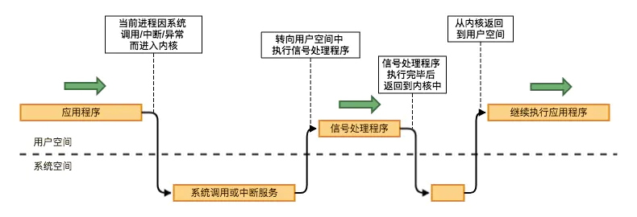

# 热重启原理

热重启 作为nginx的核心功能，让大家在更改了配置文件或者升级了nginx时都可以做到不停机更新。

这可能也是它流行并且大家可以容忍其复杂配置的原因之一吧。

热重启的命令为 `nginx -s reload`, 只要一执行，大家的nginx就重启了，并且大家的http 请求不会受到影响，所以大家的站点没有1秒收到影响，没有下线，简直平滑。

那么它到底是怎么工作的呢？

执行流程

```
执行 nginx -s reload
      ↓
master进程 启动 新的master进程        （所以大家升级nginx，热重启时用的是新的 binary文件）
      ↓
新的master进程 解析配置               （所以配置变动可以生效）
      ↓
配置正确则会fork 一批新的worker进程     （此时旧的master 和 worker都是存在的）
      ↓
旧的worker进程不再接受新的请求，新的请求只会由 新的worker进程 接受
      ↓
旧的master进程发送QUIT命令 关闭 旧的worker进程    （所以旧进程的连接会被关闭）
      ↓
旧的master进程关闭自己
      ↓
热重启结束
```

看着流程简单，其实里面有非常重要俩个技术基石保证了这套机制：

1. 如何通知其他进程关闭？ 要知道直接关闭进程会导致正在处理的请求无响应

    这里关闭进程其实发送QUIT命令，收到命令的worker 会等待正在处理的请求处理完毕之后主动关闭自己

    而发送QUIT命令这个进程通信机制靠的是 信号 这项系统进程的标准通信技术基础 (signal ,像`Ctrl+C`退出之类或`kill`等都是信号)

    其本质为信号量（Semaphore），是一种用于实现计算机资源共享的IPC机制之一，其本质是一个计数器。信号量是在多进程环境下实现资源互斥访问或共享资源访问的方法，可以用来保证两个或多个关键代码段不被并发调用。

    当进入一个关键代码段之前，进程/线程必须获取一个信号量；一旦该关键代码段完成了，那么该进程必须释放信号量。其它想进入该关键代码段的线程必须等待直到第一个进程释放信号量。

    

   

2. 如何保证旧的worker进程不再接受新的请求？

    Nginx 的平滑升级是通过 fork + execve 这种经典的处理方式来实现的。准备升级时，Old Master 进程收到信号然后 fork 出一个子进程，注意此时这个子进程运行的依然是老的镜像文件。紧接着这个子进程会通过 execve 调用执行新的二进制文件来替换掉自己，成为 New Master。

    那么问题来了：New Master 启动时按理说会执行 bind + listen 等操作来初始化监听，而这时候 Old Master 还没有退出，端口未释放，执行 execve 时理论上应该会报：Address already in use 错误，但是实际上这里却没有任何问题，这是为什么？

    因为 Nginx 在 `execve` 的时候压根就没有重新 `bind` + `listen`，而是直接把 listener fd 添加到 `epoll` 的事件表。因为这个 New Master 本来就是从 Old Master 继承而来，自然就继承了 Old Master 的 listener fd，但是这里依然有一个问题：该怎么通知 New Master 呢？

    其实是`环境变量`。execve 在执行的时候可以传入环境变量。实际上 Old Master 在 fork 之前会将所有 listener fd 添加到 NGINX 环境变量：

    ``` c
        ngx_pid_t ngx_exec_new_binary(ngx_cycle_t *cycle, char *const *argv)
    {
    ...
        ctx.path = argv[0];
        ctx.name = "new binary process";
        ctx.argv = argv;

        n = 2;
        env = ngx_set_environment(cycle, &n);
    ...
        env[n++] = var;
        env[n] = NULL;
    ...
        ctx.envp = (char *const *) env;

        ccf = (ngx_core_conf_t *) ngx_get_conf(cycle->conf_ctx, ngx_core_module);

        if (ngx_rename_file(ccf->pid.data, ccf->oldpid.data) == NGX_FILE_ERROR) {
        ...
            return NGX_INVALID_PID;
        }

        pid = ngx_execute(cycle, &ctx);

        return pid;
    }
    ```

    Nginx 在启动的时候，会解析 NGINX 环境变量：

    ``` c
    static ngx_int_t
    ngx_add_inherited_sockets(ngx_cycle_t *cycle)
    {
    ...
        inherited = (u_char *) getenv(NGINX_VAR);
        if (inherited == NULL) {
            return NGX_OK;
        }
        if (ngx_array_init(&cycle->listening, cycle->pool, 10,
                        sizeof(ngx_listening_t))
            != NGX_OK)
        {
            return NGX_ERROR;
        }

        for (p = inherited, v = p; *p; p++) {
            if (*p == ':' || *p == ';') {
                s = ngx_atoi(v, p - v);
                ...
                v = p + 1;

                ls = ngx_array_push(&cycle->listening);
                if (ls == NULL) {
                    return NGX_ERROR;
                }

                ngx_memzero(ls, sizeof(ngx_listening_t));

                ls->fd = (ngx_socket_t) s;
            }
        }
        ...
        ngx_inherited = 1;

        return ngx_set_inherited_sockets(cycle);
    }
    ```

    一旦检测到是继承而来的 socket，那就说明已经打开了，不会再继续 bind + listen 了：


    ```c
    ngx_int_t ngx_open_listening_sockets(ngx_cycle_t *cycle)
    {
        ...
        /* TODO: configurable try number */

        for (tries = 5; tries; tries--) {
            failed = 0;

            /* for each listening socket */

            ls = cycle->listening.elts;
            for (i = 0; i < cycle->listening.nelts; i++) {
            ...
                if (ls[i].inherited) {

                    /* TODO: close on exit */
                    /* TODO: nonblocking */
                    /* TODO: deferred accept */

                    continue;
                }
                ...

                ngx_log_debug2(NGX_LOG_DEBUG_CORE, log, 0,
                            "bind() %V #%d ", &ls[i].addr_text, s);

                if (bind(s, ls[i].sockaddr, ls[i].socklen) == -1) {
                    ...
                }
                ...
            }
        }

        if (failed) {
            ngx_log_error(NGX_LOG_EMERG, log, 0, "still could not bind()");
            return NGX_ERROR;
        }

        return NGX_OK;
    }
    ```


所以综上所述，nginx 在http 这些协议是可以保证自己平滑迁移

而在tcp这些上是一定会close旧的，属于有损更新迁移， 虽然nginx已经支持四层代理，但是大家需要注意这点。

## [openresty基础目录](https://fs7744.github.io/nature/prepare/openresty/index.html)
## [总目录](https://fs7744.github.io/nature/)