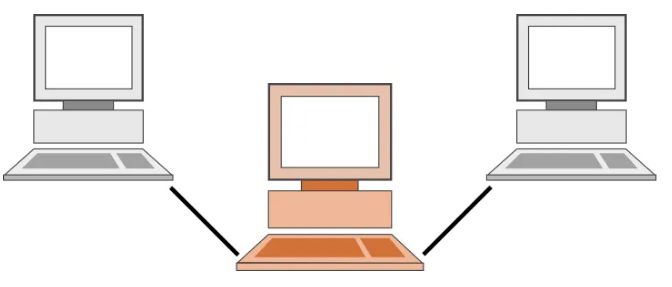
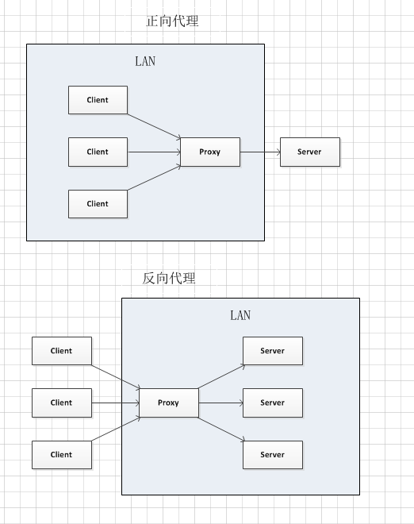

# 反向代理是什么？

反向代理是位于 Web 服务器前面的服务器，其将客户端（例如 Web 浏览器）请求转发到这些 Web 服务器。反向代理通常用于帮助提高安全性、性能和可靠性。为了更好地理解反向代理的工作原理以及它可以提供的好处，我们来理解什么是代理。

## 什么是代理

代理也被叫做网络代理，是一种比较特殊的网络服务，允许一个终端（通常指客户端）通过这个服务与另一个终端（通常指服务器端）进行非直接的连接。

例如：一些网关、路由器等网络设备都具备网络代理的功能。

代理服务有利于保障网络终端的隐私或者安全，可以在一定程度上阻止网络攻击（因为通过代理，可以隐藏真正的服务器端/客户端）

左边和右边的电脑在通讯时候，需要经过中间的电脑中转，而中间的那部电脑就是代理服务器。

作为不同场景，我们习惯将代理分为正向代理和反向代理两类。

## 什么是正反向代理

一幅图就可以很简单说明其区别： 正向代理代理客户端，反向代理代理服务器

#### 正向代理

比如大家想看YouTube上的视频，但是出于某些大家都知道的原因，大家的电脑无法访问，为了解决这个访问限制问题，大家在自己电脑上搭建的翻墙软件就是正向代理的作用 。

#### 正向代理的用途

* 访问被禁止的资源
  让客户端访问原本不能访问的服务器。可能是由于路由的原因，或者策略配置的原因，客户端不能直接访问某些服务器。为了访问这些服务器，可通过代理服务器来访问
  * 突破网络审查（比如谷歌、youtube…）
  * 再比如客户端IP被服务器封禁，可以绕过IP封禁
  * 也可以突破网站的区域、国家限制
* 隐藏客户端的地址
  对于被请求的服务器而言，代理服务器代表了客户端，所以在服务器或者网络拓扑上，看不到原始客户端，比如爬虫、肉鸡等最基本的方式就是利用这点
* 进行客户访问控制、过滤内容
  * 可以集中部署策略，控制客户端的访问行为（访问认证等）
  * 记录用户访问记录（上网行为管理）
  * 内部资源的控制（公司、教育网等）
  * 可以通过代理服务器统一过滤一些危险的指令/统一加密一些内容、防御代理服务器两端的一些攻击性行为，比如屏蔽 rm 命令
* 加速访问资源
  * 使用缓冲特性减少网络使用率（代理服务器设置一个较大的缓冲区，当有外界的信息通过时，同时也将其保存到缓冲区中，当其他用户再访问相同的信息时， 则直接由缓冲区中取出信息，传给用户，以提高访问速度。
  * 游戏加速软件那些低延迟、直连服务器等行为

### 反向代理

反向代理（reverse proxy）：是指以代理服务器来接受internet上的连接请求，然后将请求转发给内部网络上的服务器，并将从服务器上得到的结果返回给internet上请求连接的客户端，此时代理服务器对外就表现为一个反向代理服务器。

#### 反向代理的作用

* 隐藏服务器真实IP
  可以对客户端隐藏服务器的IP地址。
  这样把服务器从美国搬到中国也不会让大家找不到网站了。
* 负载均衡
  反向代理服务器可以做负载均衡，根据所有真实服务器的负载情况，将客户端请求分发到不同的真实服务器上。
  当一台干不动请求的活时，我们可以方便得招更多的苦工来干活。
* 提高访问速度
  反向代理服务器可以对于静态内容及短时间内有大量访问请求的动态内容提供缓存服务，提高访问速度。
  所以一定程度上干活的服务器挂了，还有部分资源可用，cdn之类也是通过这样减少延迟，提高速
* 提供安全保障
  反向代理服务器可以作为应用层防火墙，为网站提供对基于Web的攻击行为（例如DoS/DDoS）的防护，更容易排查恶意软件等。还可以为后端服务器统一提供加密和SSL加速（如SSL终端代理），提供HTTP访问认证等。

## 总结, 请记住：

* 正向代理为客户端服务。
* 反向代理为服务器端服务。

## [目录](https://fs7744.github.io/nature/)